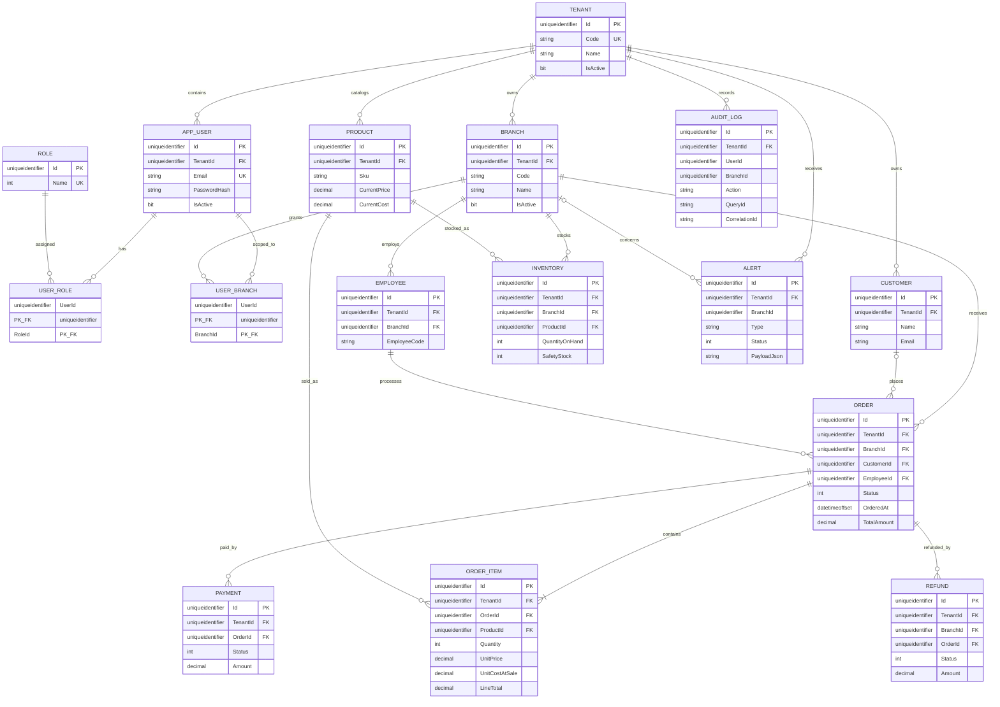

# GD2 Entity Relationship Diagram

All aggregate roots except `Role` carry `TenantId`; branch-bound transactions additionally carry `BranchId`. `OrderItem.UnitCostAtSale` preserves historical COGS input and prevents recalculating past gross profit from `Product.CurrentCost`.
