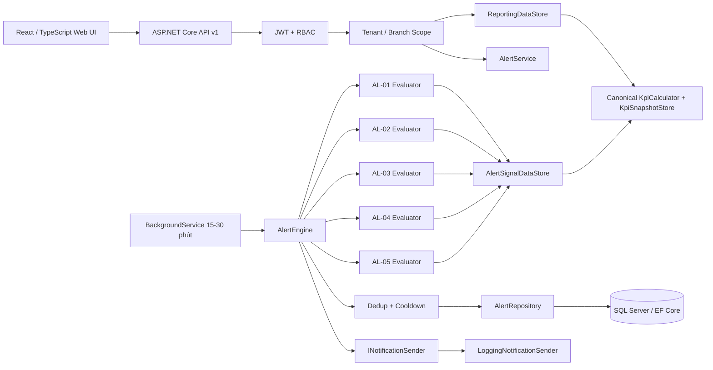

# Kiến trúc GD3

## Tổng quan

GD3 mở rộng kiến trúc bốn layer của GD2, không tạo đường tắt từ Web UI tới database.

## Ranh giới layer

- `Hosco.Domain`: `AlertRule`, `Alert`, enum status/severity và entity thương mại GD2.
- `Hosco.Application`: canonical KPI semantics, UTC+7 `IBusinessTime`, typed Alert config, evaluator Strategy, engine orchestration, workflow service, `TimeProvider` và abstraction persistence/notification.
- `Hosco.Infrastructure`: EF mapping/repository, signal query, seed và Migration.
- `Hosco.Api`: controller, authorization policy, scheduler hosted service, structured logging và composition root.
- `Hosco.Web`: API client tập trung, page/component/type; không tham chiếu database.

## Scope và security

Tenant không xuất hiện trong request filter. `ReportingScopeFactory` suy ra Tenant từ JWT. Chỉ ChainManager tenant-wide; Owner, BranchManager và SystemAdmin bị giới hạn vào branch claim rõ ràng. Store scope = Branch scope trong MVP. Alert list/detail/rule dùng cùng `ReportingScope`; tài nguyên ID ngoài scope trả 404 để không lộ sự tồn tại. Thay đổi Alert Rule yêu cầu `Owner`, `ChainManager` hoặc `SystemAdmin` và vẫn áp dụng branch scope.

## Thời gian và khả năng kiểm thử

Evaluator nhận `now` do `AlertEngine` lấy từ `TimeProvider`, không gọi `DateTime.Now`. Business date/clock và peak windows đi qua `IBusinessTime` UTC+7. Scheduler tạo DI scope riêng cho mỗi chu kỳ. Lỗi một rule được ghi log qua `IAlertEngineDiagnostics`; các rule còn lại tiếp tục.

Return allocation dùng bảng chuẩn hóa `RefundItem(RefundId, OrderItemId, Quantity, ReturnedValue)`. `Returned`/`PartiallyReturned` được xem là post-completion lifecycle: sale vẫn được nhận diện nhưng valid quantity/value/COGS bị khấu trừ theo allocation. Partial return không có allocation không bị giả lập.
